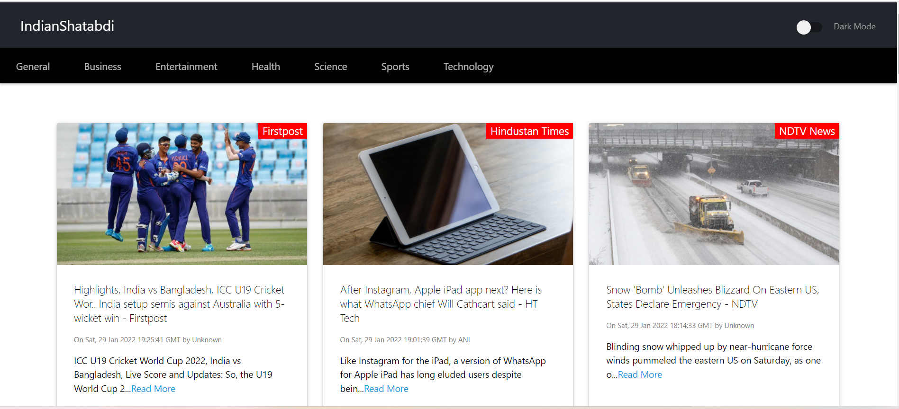
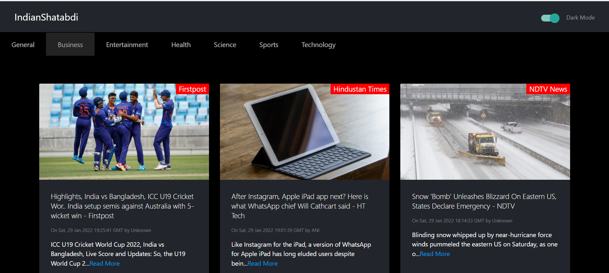

Indian Shatabdi
A news reading application which uses News API to fetch latest news headlines from different source channels . Based on the endpoint , user gets option to switch to different categories of news like sports , entertainment etc .

It Uses ReactJs , CSS , Html as major technologies .

Front-end has been created with some components like Infinite scrolling , Top Loading Bar etc .

Also user can switch to dark as well as light theme .

